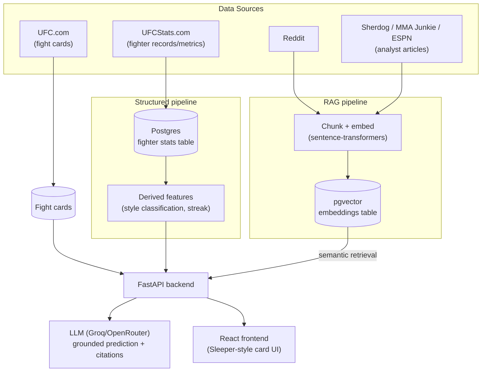

# AI UFC Prediction

A full-stack app that tracks UFC fight cards and generates fight predictions by combining two
different kinds of data: **structured fighter statistics** (records, striking/grappling
metrics) pulled directly from a database, and **qualitative fan/analyst sentiment**
(Reddit threads, analyst articles) retrieved via a **RAG (Retrieval-Augmented Generation)**
pipeline. Predictions are grounded in both hard numbers and real commentary — not just one
or the other.

This project is being built end-to-end, from scraping through cloud deployment, as a
hands-on demonstration of **RAG system design** (chunking, embeddings, semantic retrieval)
and **AWS cloud infrastructure** (RDS, ECS/Fargate, EventBridge).

## Architecture

Three deliberately separate data pipelines feed the final prediction — structured data is
never embedded, and unstructured text is never force-fit into SQL columns:



**Key principle:** exact data (records, stats) belongs in Postgres, queried directly.
Embeddings are only for unstructured text where semantic search is genuinely needed.

## Tech stack

| Layer | Tools |
|---|---|
| Scraping / ingestion | Python, `requests` + BeautifulSoup, Playwright (for JS-rendered / anti-bot sites), PRAW |
| RAG | `sentence-transformers` (local embeddings), pgvector |
| Structured data | PostgreSQL |
| Backend *(planned)* | FastAPI |
| Frontend *(planned)* | React |
| LLM | Groq / OpenRouter |
| Infra *(planned)* | Docker, AWS ECS/Fargate, RDS, EventBridge, S3/CloudFront |

## Notable engineering problems solved

This isn't a tutorial-following project — most of the real work has been handling how
messy production scraping actually is:

- **Anti-bot bypass, done properly.** UFCStats.com and ESPN both sit behind JS
  proof-of-work / WAF challenges that block plain HTTP clients. Solved with Playwright
  driving a real headless browser, with wait strategies tuned per-site (e.g. ESPN's page
  never reaches `networkidle` due to constant ad polling — timed empirically and used a
  short fixed settle wait instead).
- **Shadow DOM scraping.** MMA Junkie renders its search results and article bodies
  entirely inside Shadow DOM, invisible to both plain HTML parsing *and* Playwright's own
  `page.content()` (which doesn't serialize shadow roots). Solved with a recursive JS
  shadow-root walker injected via `page.evaluate()`.
- **Cross-site entity resolution.** Fighter names don't match cleanly across sources —
  accented characters get silently stripped or transliterated differently
  (`Uroš Medić` → `Uros Medic` vs. dropped entirely), nicknames get embedded in display
  names (`Michael "Venom" Page` → `Michael Page`), and some sites have multiple genuinely
  different people sharing a name. Solved with Unicode-normalized matching, first/last-name
  fallback matching, and physical-attribute cross-checks (height/weight) against
  already-scraped data to disambiguate.
- **Data-quality debugging, not just "it ran without errors."** Found and fixed scrapers
  that were silently pulling ad-widget and social-embed HTML into what was supposed to be
  clean article text — caught by manually verifying scraped output against the real page,
  not just checking the script exited 0.

## Current status

- [x] Fight card scraper (UFC.com) — 14 events
- [x] Structured stats scraper (UFCStats.com) — 300+ fighters, full career/striking/grappling metrics
- [x] RAG source scrapers — Sherdog, MMA Junkie, and ESPN analyst articles, keyed per fight
- [x] Chunking + local embedding pipeline (`sentence-transformers`)
- [ ] Reddit + X/Twitter RAG sources (blocked on external account/API issues, not code — see `CLAUDE.md`)
- [ ] pgvector + Postgres storage layer
- [ ] FastAPI backend
- [ ] React frontend
- [ ] Docker + AWS deployment (ECS/Fargate, RDS, EventBridge)

See [`CLAUDE.md`](./CLAUDE.md) for the full architecture rationale, build order, and
detailed engineering notes.

## Running it locally

```bash
python3 -m venv venv
source venv/bin/activate
pip install -r requirements.txt
playwright install chromium

# scrape fight cards, then everything else depends on it
python ingestion/fight_cards/scrape_fight_cards.py
python ingestion/ufcstats/scrape_fighter_stats.py
python ingestion/rag_sources/scrape_sherdog.py
python ingestion/rag_sources/scrape_mmajunkie.py
python ingestion/rag_sources/scrape_espn.py

# chunk + embed the RAG sources
python processing/chunk_and_embed.py
```

Reddit and X scrapers require API credentials in a local `.env` (see `.env.example`).
